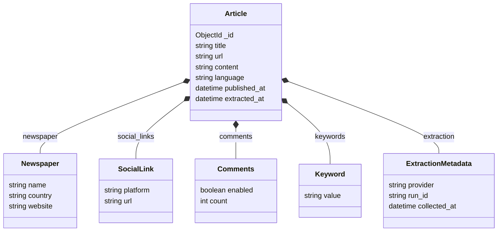

# Diagrama de documentos 1.0v

Este diagrama representa la primera propuesta del modelo documental para la base de datos en **MongoDB**. Cada artículo será almacenado como un documento principal junto con la información relevante para su posterior procesamiento y análisis.

El documento `Article` contiene los datos principales del artículo: título, URL, contenido, idioma y fechas de publicación y extracción.

Además, almacena información asociada mediante documentos embebidos:

* **Newspaper:** identifica el periódico, su país y sitio web.
* **SocialLink:** almacena enlaces relacionados con redes sociales o publicaciones asociadas.
* **Comments:** indica si el artículo posee comentarios y cuántos tiene.
* **Keyword:** representa las palabras clave encontradas o asociadas al artículo.
* **ExtractionMetadata:** mantiene la trazabilidad de la extracción, indicando el proveedor utilizado, la ejecución y la fecha de recolección.

Es importante diferenciar el **periódico** de la **fuente de extracción**. Por ejemplo, un artículo puede pertenecer a *El Tiempo*, pero haber sido encontrado mediante **GDELT** o **MediaCloud**.

Esta versión 1.0 funciona como modelo inicial y podrá evolucionar a medida que se incorporen nuevas fuentes y se definan nuevos datos necesarios para el análisis.
